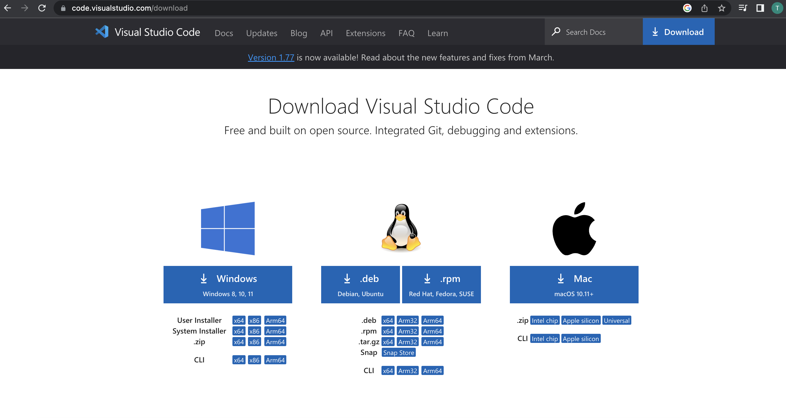
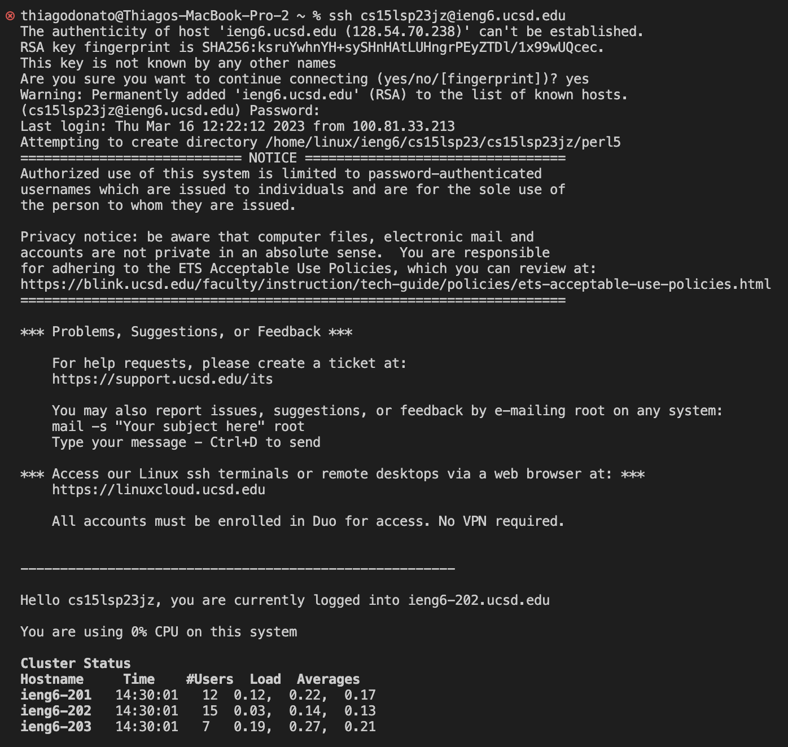

__Hello! This is my lab1 report for CSE15L__
Note to future self: follow these instructions to log into a course-specific account on @ieng6
[Link to lab instructions](https://ucsd-cse15l-s23.github.io/week/week1/)

# Installing VScode:
Go to this URL: https://code.visualstudio.com/download
It should look like this:

Download the version compatible with your device.

# Remotely connecting
## Student account number

Look up your course-specific account for CSE15L here:
https://sdacs.ucsd.edu/~icc/index.php
For now, your username is: cs15lsp23jz

## SSH connect with username and passowrd
Note: if in Windows computer, might need to install _git_ on Windows

1) Use the command ssh cs15lsp23jz@ieng6.ucsd.edu (notice I use my specific account number there)
1.1) If it's your firsrt time connecting, you will get a warning message, just type yes to connect
2) Enter your passoword

It should look something like this

# Trying out some commands
