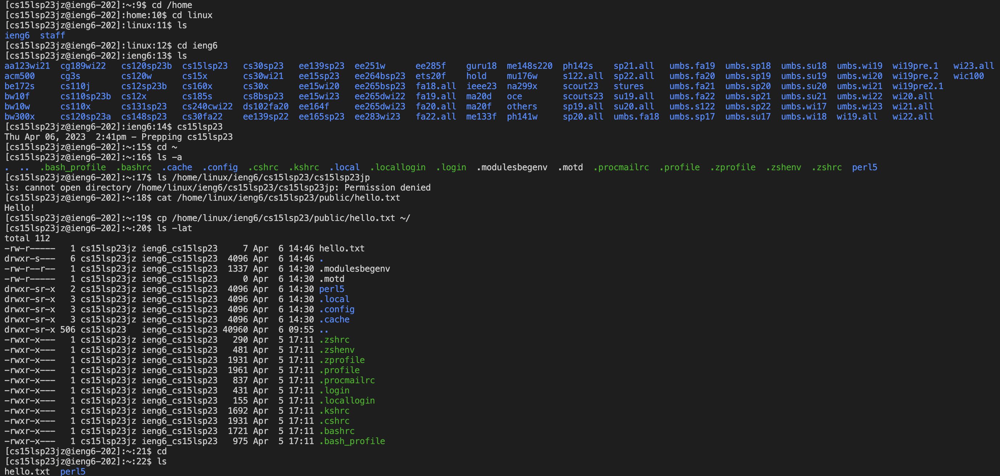

__Hello! This is my lab1 report for CSE15L__  
Follow these instructions to log into a course-specific account on @ieng6.  
[Link to lab instructions](https://ucsd-cse15l-s23.github.io/week/week1/)

# Installing VScode:
Go to this URL: https://code.visualstudio.com/download. 
It should look like this:  
  
Download the version compatible with your device.

# Remotely connecting
## Student account number

Look up your course-specific account for CSE15L here:
https://sdacs.ucsd.edu/~icc/index.php  
For now, my username is: cs15lsp23jz

## SSH connect with username and passowrd
Note: if in Windows computer, might need to install _git_ on Windows

1) Use the command ssh cs15lsp23jz@ieng6.ucsd.edu (notice I use my specific account number there)
1.1) If it's your firsrt time connecting, you will get a warning message, just type yes to connect
2) Enter your passoword

It should look something like this:  

# Trying out some commands
Some cool commands to try:
* cd ~
* cd
* ls -lat
* ls -a
* ls <directory> where <directory> is /home/linux/ieng6/cs15lsp23/cs15lsp23abc, where the abc is one of the other group members’ username
* cp /home/linux/ieng6/cs15lsp23/public/hello.txt ~/
* cat /home/linux/ieng6/cs15lsp23/public/hello.txt
  
These should look something like this:  

